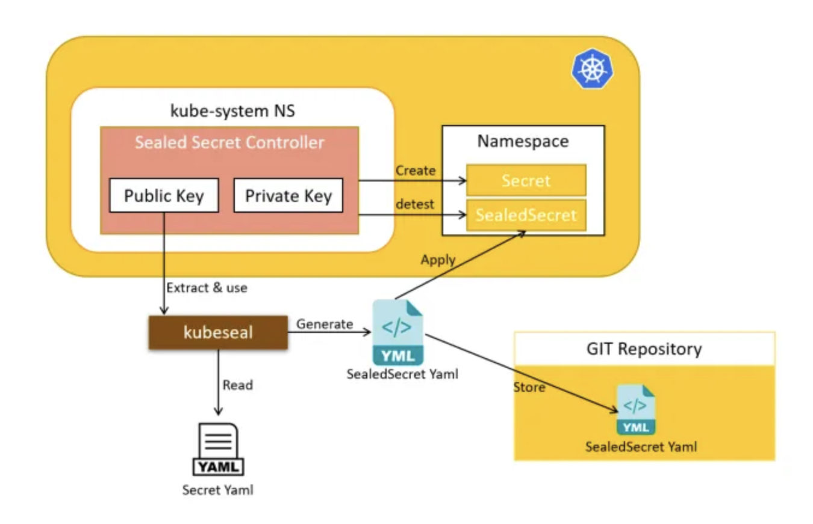

# Managing K8s Sgit ecrets Securely in **Git** with Sealed Secrets

## **Problem Statement**

Although, Kubernetes offers a way to store sensitive data using the Secret object, it is really not a secret, it is just a base64 encoded strings that anyone with access to the cluster or the source code can easily decode.

**Important:** Kubernetes Secrets are, by default, stored unencrypted in the API server's underlying data store (etcd). Anyone with API access can retrieve or modify a Secret, and so can anyone with access to etcd. Additionally, anyone authorized to create a Pod in a namespace can use that access to read any Secret in that namespace; this includes indirect access, such as the ability to create a Deployment

Securing secrets on the source code is the big issue, as anyone who has access to the repositories containing the secret definitions can also decode them.

Since we are using git as our single source of truth, we need to be able to store everything in git including sensitive data without the fear of being compromised.

We would be implementing how to setup secure secrets using **sealed secret** from Bitnami

## **Prerequisites;**

- Kubernetes cluster - I used *minikube* for this purpose.

- Client side utility **`Kubeseal CLI`**

- Server side utility **`Sealed Secret Controller`**

**Quick Workflow Overview**



- Encrypt the secret on the developer machine using a public key and the kubeseal CLI. This encodes the encrypted secret into a Kubernetes Custom Resource Definition (CRD)

- Deploy the CRD to target cluster

- The Sealed Secret controller decrypts the secret using a private key on the target cluster to produce a standard Kubernetes secret.

NOTE; The private key is only available to the `Sealed Secrets controller` on the cluster, and the public key is available to the developer. This way, only the cluster can **decrypt** the secrets, and the developers can only **encrypt** them.

## Objectives

Demonstrate the secure storage and deployment of secrets using `Bitnami Sealed Secrets`.
Basically there are two main actors in this process; the *local client* and the *cluster controller* or operator. 

1. The Local Client is a tool named `kubeseal` and it will be the tool in charge of creating the manifests ready to be stored safely in the repository.

2. The `controller/operator` is a tool installed in the K8s cluster and in charge of `transforming` the sealed secret coming from the repository and encrypted into a Kubernetes secret capable of being consumed by an application.

3. A customer resource definition (CRD) called `SealedSecret`

## Implementing the Architecture

1. Using the Helm package manager, install the `Sealed Secrets Controller` on the Kubernetes cluster.

```
helm repo add sealed-secrets https://bitnami-labs.github.io/sealed-secrets

helm install sealed-secrets -n kube-system sealed-secrets/sealed-secrets
```


- Install kubeseal cli `brew instal kubeseal`. The kubeseal utility uses asymmetric crypto to encrypt secrets that only the controller can decrypt.

2. Create kubernetes Secret and encrypt the secret using the command below;

```
kubectl create secret generic dareyio-secret --from-literal mayorusername=my-secure-username mayorpwd=my-secure-password --dry-run=client -o yaml | kubeseal  | tee my-sealed-secret.yaml
```

or 

create a simple manifest file `my-secret.yml` for a secret

```
sudo cat <<EOF > my-secret.yml
apiVersion: v1
kind: Secret
metadata:
  name: mayorio-secret
type: Opaque
data:
  mayorusername: bXktc2VjcmV0LXVzZXJuYW1lCg==
  mayorpwd: bXktc2VjcmV0LXBhc3N3b3JkCg==
EOF
```

`kubeseal --format yaml < my-secret.yml > my-sealed-secret.yaml`


`kubeseal` will encrypt the **Secret** using the public key that it fetches at runtime from the controller running in the Kubernetes cluster

3. View the created Sealed Secret `my-sealed-secret.yml`

```
apiVersion: bitnami.com/v1alpha1
kind: SealedSecret
metadata:
  creationTimestamp: null
  name: mayorio-secret
  namespace: default
spec:
  encryptedData:
    mayorpwd: AgBQe/UudYVIhh+B39Bf4wrM38O6AOuZwKhrFYgaPfj8zVFy+ceKR+U/gjpxqKIqUvO69Gyn1UMDxruEnC3oK+sVqCaGUfEMDKlD1sTMeghg4DUi2qqBMwPnduZ22rDKeTlsOYHWGc/E/SefhgbaWF1+KlC314Zh0XRh7c2U6sIS6CTU9LeMpChqYmz7NncVHPUW79Uulh3Jn6FqxrtSy1v+eKZsl7mPsF3eEvluLg1e75EC8uu9t7D1ZzAlmTvof6WNunvcswun3N6R35xJzHc2B4iYCyN0XIzBUMe1Upb+xKkq0nUziorC/ClkKpPXGVdcu7uuCHu30FCY9xLmWRJfxHxoUzYb3irQAgQwVWoKk6iVpV4vhT6ngnz9mr+4K97+Kw807Nb884ezzeOBEixiYhzf0t5ArgRLR+XwsoYNdT6hoApetI2oTcaQLEVHDLSViUoVR4n0YYJdRYCNMYA5FsngSjxNwN3p7u2rdPBuXBkccD+tvUC+Uh12ynfvLOMMwe+V+/P35B/6h4OE5a/MUkqnA6wklZ0014f8NljZADkiHWCUb1jETG51yUSvK1eGnXKV/nbpxtEQOo2vflFxXeatc3vCw4lmEtP0jwRqsmZ1tnYHieMpNFPfq8yQ1zvkYS0p9sWX9s8KBX4Tft3CGvp+/4GJto6c1paVEhMYf4nDDVbdnRhoGgy7UjKwWPyNy5eJEF2IH7oFukR2NkyBAHWL
    mayorusername: AgAIyN9hF3MSis7YfV2GnBR2TQPFKFHdusMRxsObeAovqowffhQ2q4b8EN01vH0uAMGqNKAByKYJftfyGGPyn7YEEU344dZ1Fa2YpIO2/yOb3tztCzW74EmMAr3jGnUz2XLqST73icchNiCgihRGZrLsZoTHog5cDd/mAnTdeqHfMwT/em4ozb+VYzwS/1hsQ0HKqhMOSGBwqY1m2oWzQQ4wr2FHv5r7Y8ZG+5rQv5NEjRDdHb+tHlXqZJQEQx75UEGcTrPQ9ddoY0CXa7Q3NNDGTqnHdc3RD74m3MAm3+k+Rbw41Eo5mOnKinKJCoWMWb7DjTjHUok4oxoY9CMCmLiVaes9weweqv5xPNivk5ZVtTr/dDcjiegLQtXzou6QgoZ91FYyaCrdS9O250Fop8d/xRRXFF2qbLIJ++MQUsNXb6tnkSeGJ06uiRvwqiXzcMYA4JRB9+d4QQUnPmPEO56InrWp/MhE1VHNo1P5akvaTQdx4BGZ20b1IFR7K5N7hBUyj3FQ82BqPl48bA9lALcytEnbSTUukvtFvjeIqO1Sx3g/Paab+GZfImnXnJolRXIrU+3rlmP+BlEhoZXlZJZyn45jpbgffpDyJC9Qworja5QTk+v7h6mVFGVTkH/pqwSgE7N6H1mUnpAn92ur2ams7hT6nxSQPBuxpY9rvXj0uhT0hlJkbobfHkLgTRuU1vBa7EG2Y7QwwiwmU9bVLM3nGLEB
  template:
    metadata:
      creationTimestamp: null
      name: mayorio-secret
      namespace: default
    type: Opaque
```

We have a `sealed secret` ready to be stored in the Git repository.

4. Apply the Sealed Secret:

Apply the Sealed Secret to the cluster with ArgoCD or the command below.

This will create the object in the cluster and will trigger the controller to create an unsealed secret deciphering it with its private key and creating a normal base64 encoded secret

```
kubectl apply -f my-sealed-secret.yml
```

```
kubectl get secret mayorio-secret -o yaml
```


The YAML manifest that pertains to the Secret is no longer needed and may be deleted. The SealedSecret is the only resource that will be deployed to the cluster.